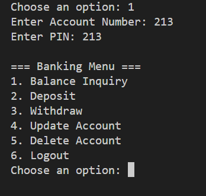
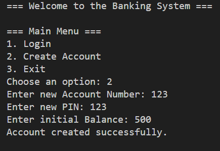
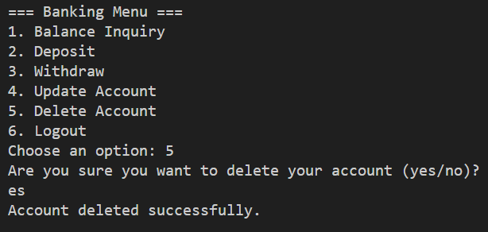
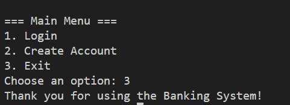

# Banking System

A simple Java-based banking application demonstrating Object-Oriented Programming (OOP) concepts, JSON file handling, and command-line user interaction. This project includes a login system, balance inquiry, deposit, withdrawal, and account management features.

## Features

*   **Login System:** Authenticate users with account number and PIN.
*   **Balance Inquiry:** Display current account balance.
*   **Deposit:** Add funds to the account (positive amounts only).
*   **Withdraw:** Withdraw funds with a minimum balance requirement.
*   **Create Account:** Register a new bank account with an initial balance.
*   **Update Account:** Modify an existing account's PIN and balance.
*   **Delete Account:** Remove an account from the system.
*   **File Handling:** Store account data in a JSON file (`data/accounts.json`).
*   **OOP Concepts:**
    *   **Encapsulation:** Private fields with getters/setters in Account class.
    *   **Inheritance:** `SavingsAccount` extends abstract `Account` class.
    *   **Polymorphism:** Overridden deposit and withdraw methods.
    *   **Abstraction:** Abstract `Account` class defines common behavior.

## Prerequisites

*   Java Development Kit (JDK) 8 or higher
*   `json-simple-1.1.1.jar` library for JSON handling

## Setup Instructions

1.  **Clone the Repository:**

    ```bash
    git clone https://github.com/MDATIK-3/Banking-System_Java.git
    cd Banking-System_Java
    ```

2.  **Add Dependency:**

    Download the `json-simple-1.1.1.jar` file and place it in the `libs` directory within your project.

3.  **Directory Structure:**

    Ensure the following structure:

    ```
    Banking-System_Java/
    ├── src/
    │   ├── Account.java
    │   ├── SavingsAccount.java
    │   ├── Bank.java
    │   ├── Main.java
    ├── data/
    │   ├── accounts.json
    ├── libs/
    │   ├── json-simple-1.1.1.jar
    ├── README.md
    ```

4.  **Compile the Application:**

    Navigate to the root directory of the project (`D:\Account_Java`) and compile the Java source files:

    ```bash
    javac -cp "libs/*" src/Account.java src/SavingsAccount.java src/Bank.java src/Main.java
    ```

5.  **Run the Application:**

    From the root directory, run the `Main` class:

    ```bash
    java -cp "src;libs/*" Main
    ```

## Usage Guide

Upon running the application, you will be presented with a main menu:


*   **Login (Option 1):**
    *   Enter your Account Number and PIN to access your account.
    *   If successful, you will enter the Banking Menu.

*   **Create Account (Option 2):**
    *   Enter a new Account Number, PIN, and an initial Balance.
    *   A new account will be created and saved.

*   **Exit (Option 3):**
    *   Exits the application.

### Banking Menu (after successful login)



*   **Balance Inquiry (Option 1):** Displays your current account balance.
*   **Deposit (Option 2):** Allows you to add funds to your account.
*   **Withdraw (Option 3):** Allows you to withdraw funds from your account.
*   **Update Account (Option 4):** Prompts for a new PIN and new Balance to update your current account.
*   **Delete Account (Option 5):** Permanently removes your account from the system after confirmation.
*   **Logout (Option 6):** Returns to the Main Menu.

## Sample Interaction:









## Project Structure

*   `Account.java`: Abstract class with core account properties and methods.
*   `SavingsAccount.java`: Extends `Account` with specific deposit/withdraw logic.
*   `Bank.java`: Manages accounts and handles JSON file operations.
*   `Main.java`: Command-line interface for user interaction.
*   `data/accounts.json`: Stores account data.

## Future Improvements

*   Add encryption for PIN storage.
*   Support multiple account types (e.g., CheckingAccount).
*   Implement a GUI using JavaFX or Swing.
*   Add transaction history logging.

## Contributing

*   Fork the repository.
*   Create a feature branch (`git checkout -b feature-name`).
*   Commit changes (`git commit -m "Add feature"`).
*   Push to the branch (`git push origin feature-name`).
*   Create a Pull Request.

## License

MIT License - see LICENSE for details.
# Banking-System_Java

